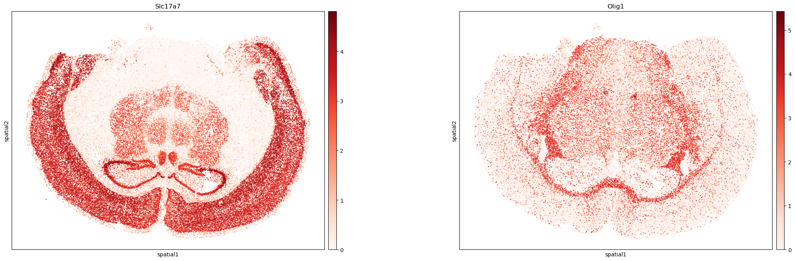

# Spatial Transcriptomics Analysis of MERFISH Mouse Brain Receptor Map

This repository contains an analysis of the MERFISH Mouse Brain Receptor Map dataset, utilizing spatial transcriptomics with Squidpy to explore gene expression patterns across three full coronal slices of the mouse brain. The dataset includes single-cell spatial gene expression measurements of 483 genes, including canonical brain cell type markers, GPCRs, and RTKs, aiming to understand brain tissue organization and function. The analysis follows a structured workflow involving data preprocessing—such as quality control, normalization, logarithmic transformation, PCA, and clustering using the Leiden algorithm—followed by visualization through UMAP projections and spatial plots to uncover cellular distributions. Marker gene analysis is conducted to identify specific cell types, with visualizations.

## Figures

### Figure 1: Quality Control Metrics

This figure visualizes quality control metrics, including the distribution of total transcripts per cell, unique transcripts per cell, and transcripts per field of view (FOV), ensuring data quality for downstream analysis.

### Figure 2: UMAP Clustering

In this figure, cells are visualized using a UMAP projection, with colors representing different clusters obtained via the Leiden algorithm. This clustering helps distinguish different cell populations based on transcriptomic profiles.

### Figure 3: Marker Gene Expression

This figure highlights the expression of key marker genes in different clusters:
- **Slc17a7:** A well-known marker for neurons.
- **Olig1:** A marker for oligodendrocytes.

### Figure 4: Spatial Clustering

Here, spatial clustering is performed using the X-Y coordinates of cells. This figure highlights how cells are organized in physical space, reinforcing the relationship between transcriptomic profiles and spatial localization.

### Figure 5: Spatial Marker Gene Visualization

This figure demonstrates the spatial distribution of the same marker genes (Slc17a7 for neurons and Olig1 for oligodendrocytes), enabling a better understanding of cell-type organization in the mouse brain slice.

## Conclusion

This analysis provides valuable insights into spatial gene expression patterns in the mouse brain, helping to identify distinct cell populations and their spatial relationships. 

---

To explore the full analysis and code, please check the Jupyter notebooks in this repository.